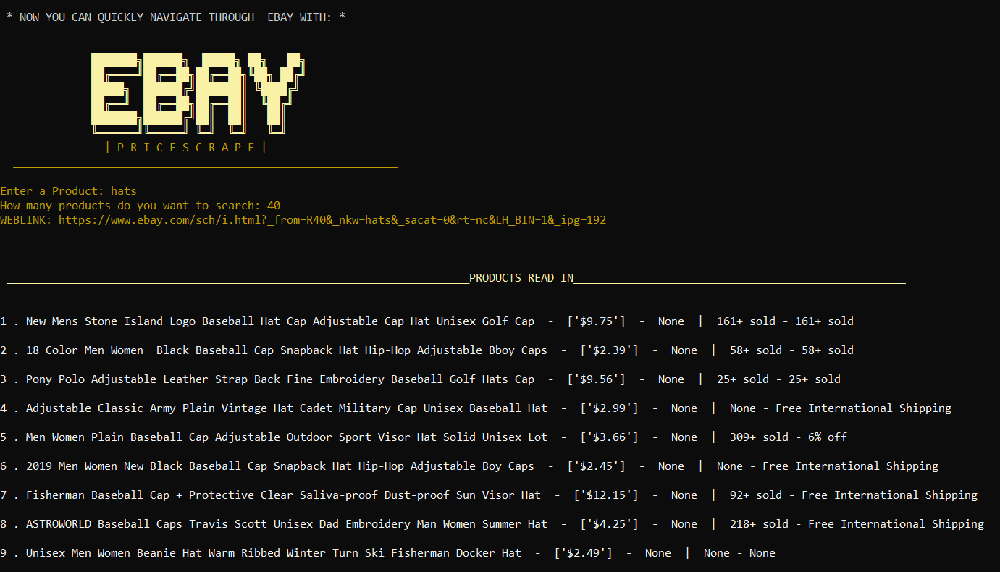
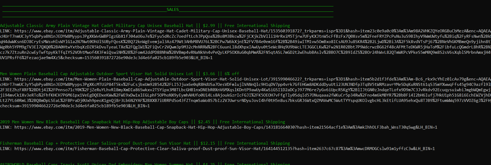
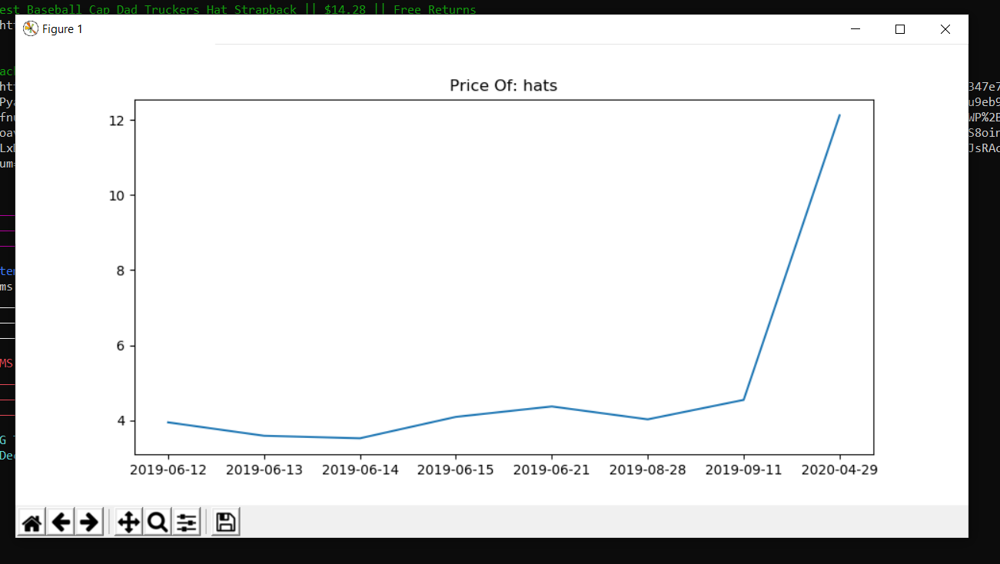

# Ebay_PriceScrape
Using the beautiful Soup library, a user is able to determine information about a specific product they request.
The information that they will be given is :
 - Product Prices
 - Sales
 - The most bought product
 - and finally the Cheapest product
 
after this a user can save the data they collected, and later on using Matplotlib the user can graph the 
saved data they have amassed.

# Requirements
 - bs4
 - Matplotlib
 - Colorama
